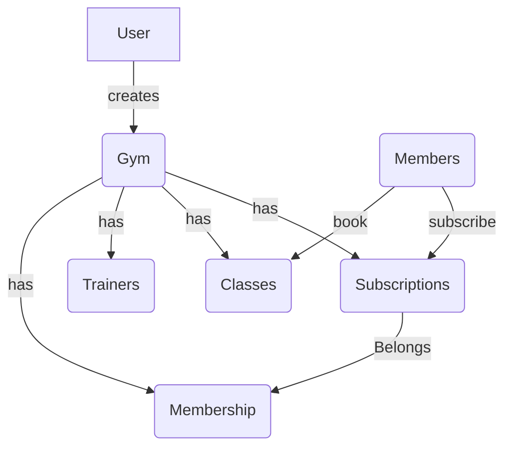

# Gym Management System

## Description

This is a Rest-API for gym management system that allows gym owners to manage their gym members, trainers, and classes. It also allows gym members to book classes and view their bookings.

## Features

-   Gym owners/admins can add, edit, and delete gym members, trainers, and classes.
-   Gym members can view their profile, book classes, and view their bookings.
-   Trainers can view their profile and classes they are teaching.
-   Admins can view all gym members, trainers, and classes.

## Domain Model Diagram

## Packages

-   **Sanctum**: Laravel Sanctum provides a lightweight authentication system for SPAs (Single Page Applications). It allows the frontend to authenticate with the backend API using token-based authentication, managing secure cookie-based session authentication for the web interface while also supporting API token authentication for mobile/desktop applications.
-   **spatie/laravel-permission**: A package that adds role-based permissions and authorization to Laravel applications. It provides a simple interface to manage roles and permissions, assign them to users, and protect routes and resources.
-   **pestphp/pest**: A testing framework for PHP with a focus on simplicity and elegance. It provides an expressive API for writing tests with less boilerplate code while maintaining full compatibility with PHPUnit.
